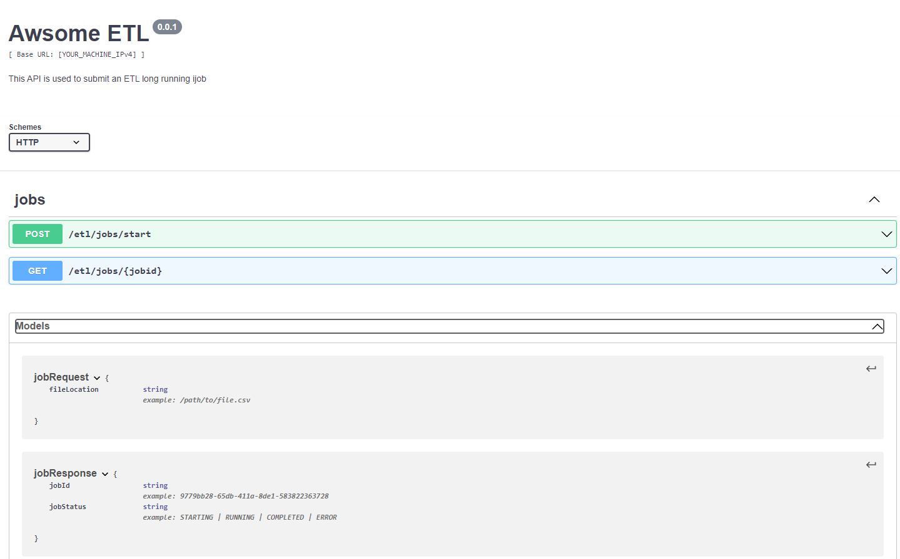

## Getting started

Those instructions will guide you to test the deployed API using Swagger Editor.

  

 <h3 align="center">API definition - Swagger Standard</h3>

 
 

## Test Application using Swagger Editor

* Copy and paste the [YOUR_MACHINE_IPv4] into [api-swagger.yaml](https://github.com/Oussama-bch/awesome-etl/blob/master/swagger/api-swagger.yaml) line 6.
* Copy and paste the [api-swagger.yaml](https://github.com/Oussama-bch/awesome-etl/blob/master/swagger/api-swagger.yaml) content into [swagger-editor](https://editor.swagger.io/#)
* Test API calls using the swagger UI

## Authors

* **Oussama BEN CHARRADA** - *Initial work*